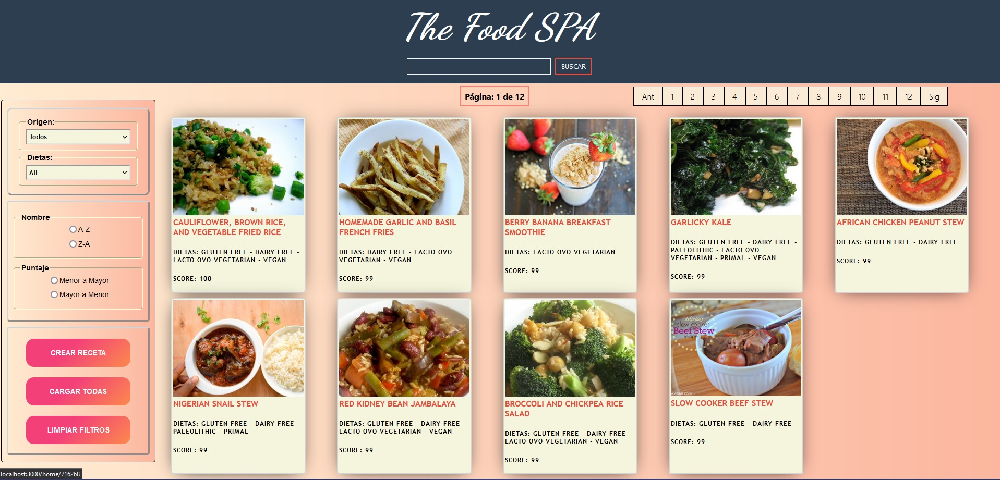
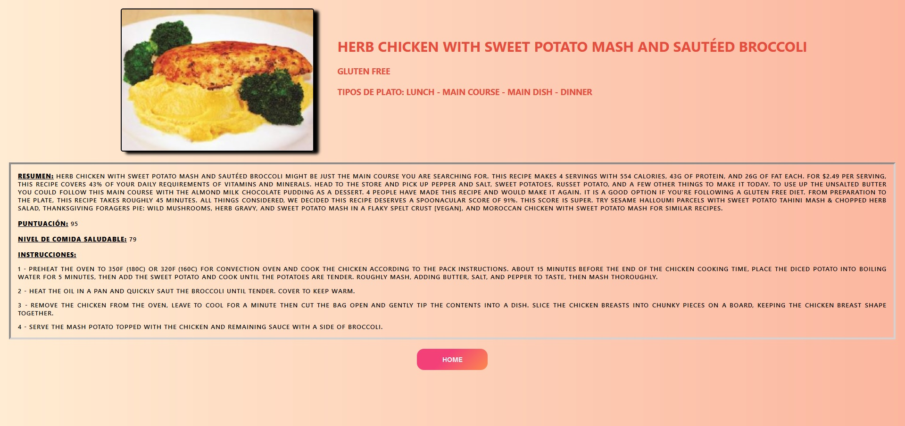
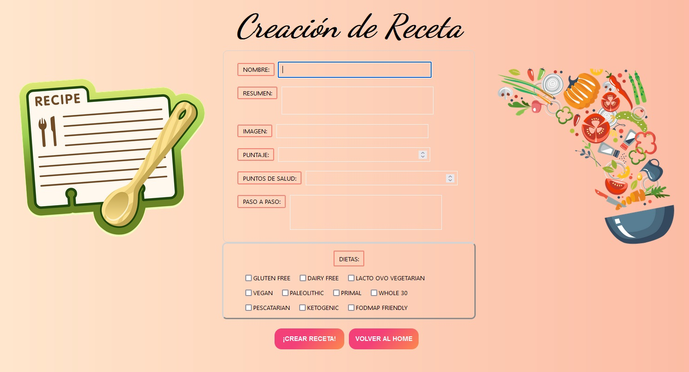

<h3 align="center">A passionate fullstack developer & systems engineer from Argentina</h3>

- 🔭 I’m currently working on **e-commerce**

- 💬 Ask me about **Javascript, React js, Redux, Node js**

- 📫 How to reach me **villagra9@gmail.com**

## Connect with me:

     

## Some Tools I Have Used and Learned:

               

## 👨🏻‍💻 My Projects
### Henry Food :green_salad: :broccoli: :poultry_leg:
SPA (Single-page Application) that integrates all the technologies seen in the bootcamp and consumes external API (https://spoonacular.com/food-api).
In the application you can search for recipes, order them by score and by name, filter them by type of diet and origin, and even add your own recipes to your database. 
Fully develop this application both frontend and backend, with the following technologies: 
Javascript | HTML | CSS | React | Redux | Node | Sequelize | PostgreSQL 
 
<a href="https://github.com/Ernest2104/PI-Food">
      
      Link a repo
</a>
 

      
      
      
      

